# Compliance Document Classifier - Component Diagrams

## Overview

This document provides detailed component diagrams for the Compliance Document Classifier system. These diagrams illustrate the structure and relationships between the various components that make up the system.

## Frontend Angular Components and Services

The following diagram illustrates the Angular frontend components and services:

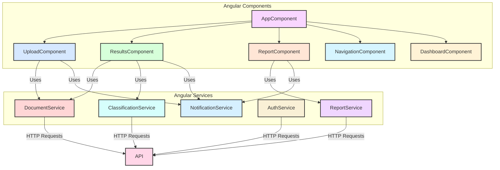

### Component Details

#### UploadComponent

The UploadComponent handles document batch uploading via a drag-and-drop interface.

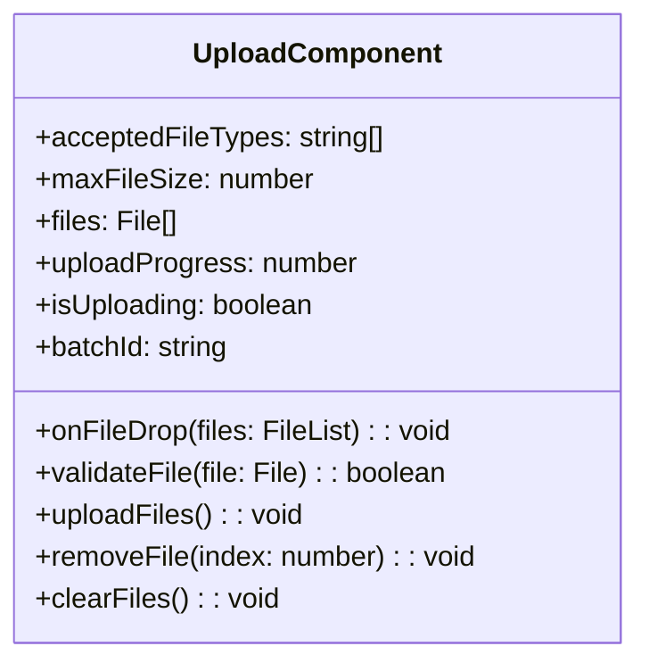

#### ResultsComponent

The ResultsComponent displays classification results in a table with filtering, sorting, and override capabilities.

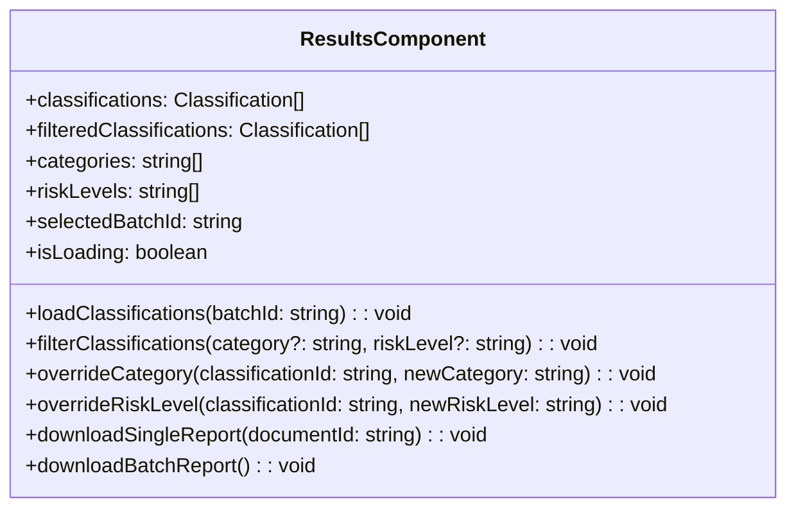

#### ReportComponent

The ReportComponent displays generated reports with options to view, download, and share.

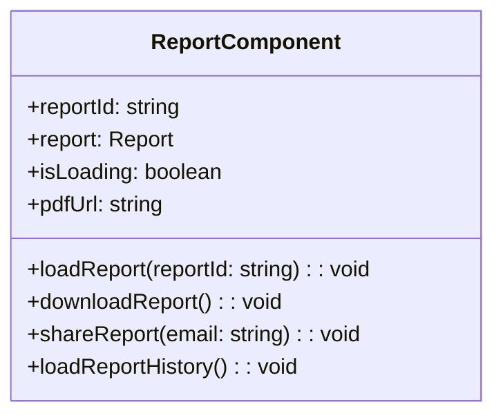

## Backend .NET Core API Controllers and Services

The following diagram illustrates the backend API controllers and services:

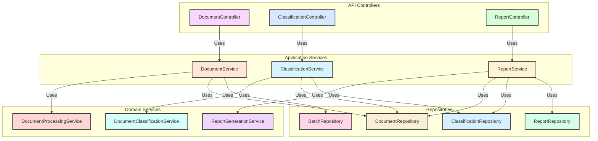

### Controller Details

#### DocumentController

The DocumentController handles document-related HTTP requests.

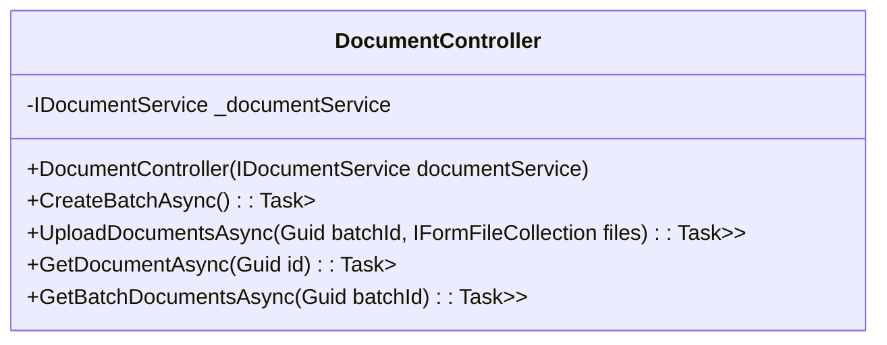

#### ClassificationController

The ClassificationController handles classification-related HTTP requests.

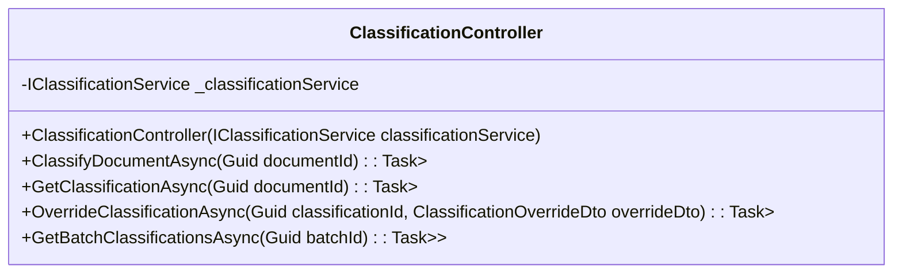

#### ReportController

The ReportController handles report-related HTTP requests.

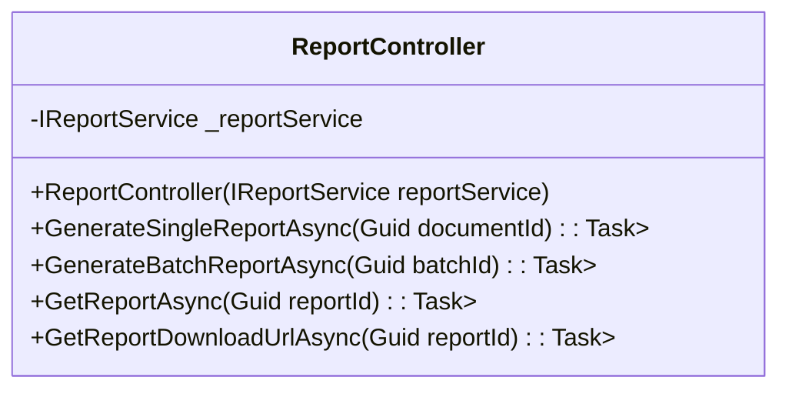

## Document Parser Modules

The following diagram illustrates the document parser modules:

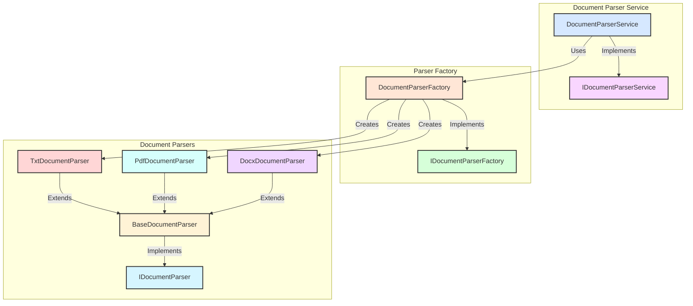

### Parser Details

#### BaseDocumentParser

The BaseDocumentParser provides common functionality for all document parsers.

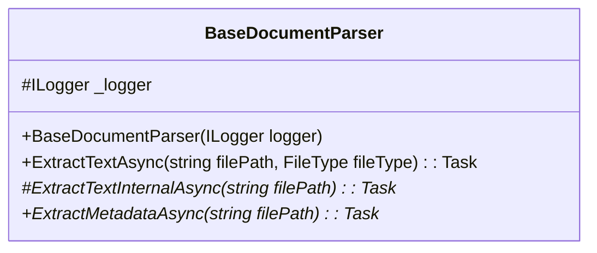

#### Concrete Parser Implementations

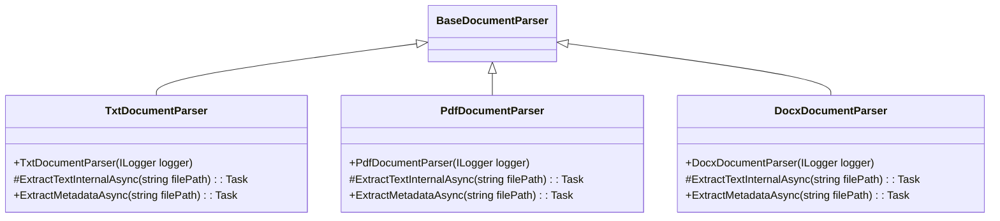

## AI Classification Service Abstraction

The following diagram illustrates the AI classification service abstraction:

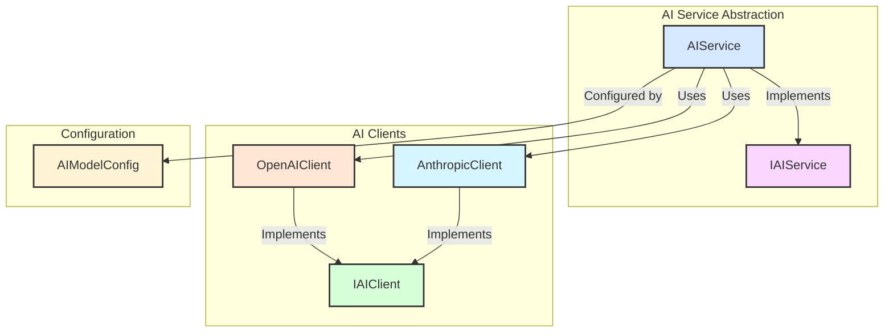

### AI Service Details

#### IAIService Interface

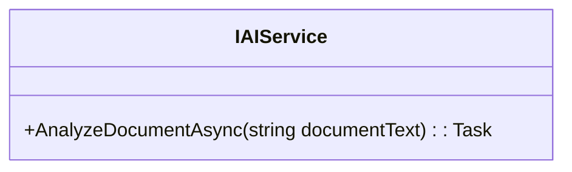

#### AIService Implementation

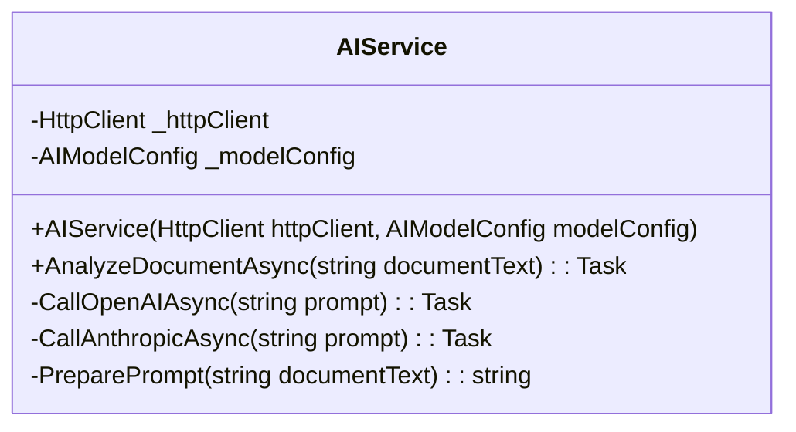

#### AIModelConfig Value Object

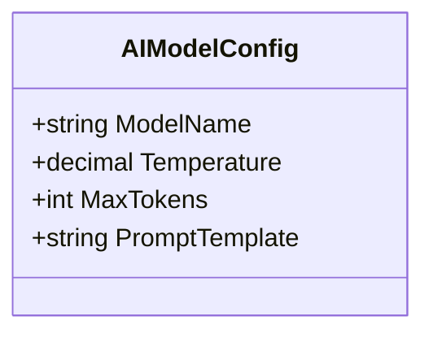

## PDF Generation Service

The following diagram illustrates the PDF generation service:

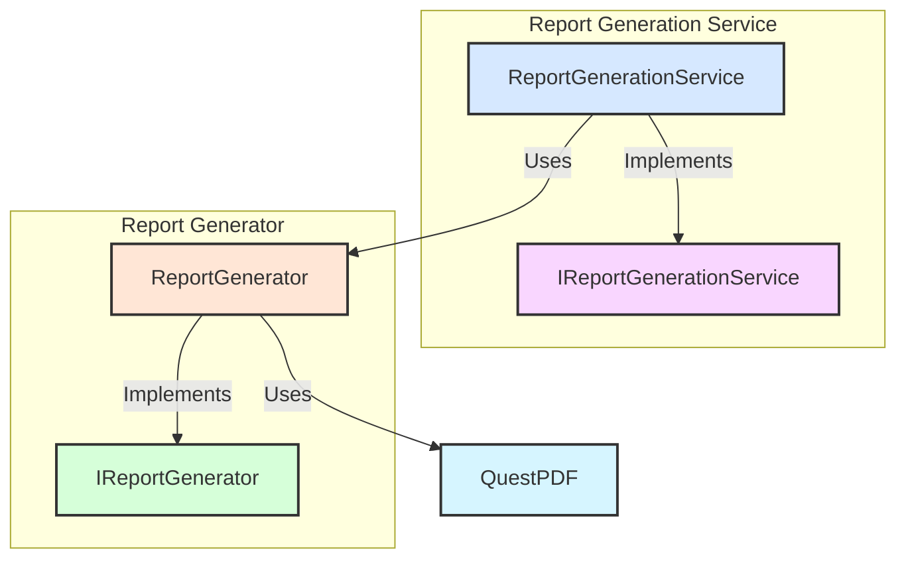

### Report Generator Details

#### IReportGenerator Interface

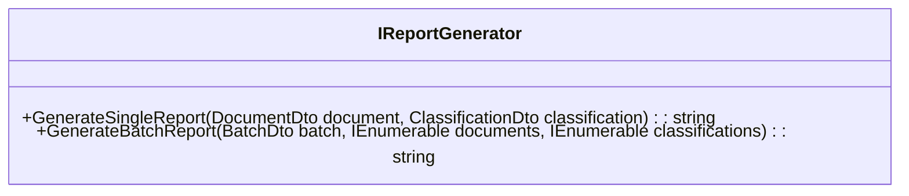

#### ReportGenerator Implementation

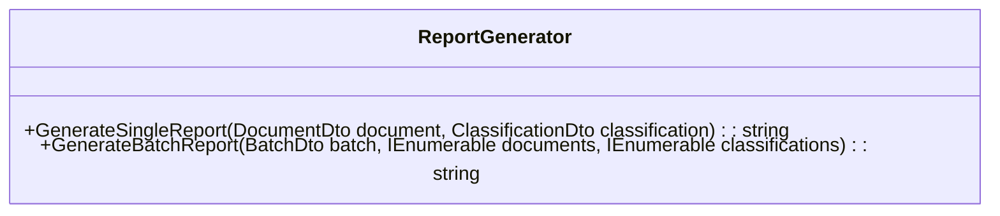

## Domain Model Components

The following diagram illustrates the domain model components:

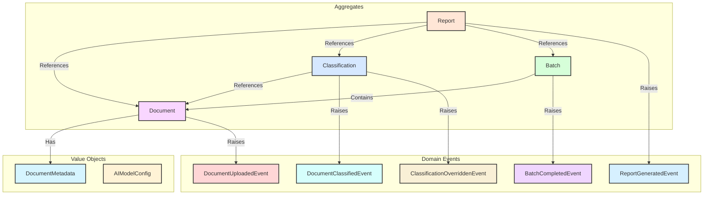

### Aggregate Details

#### Document Aggregate

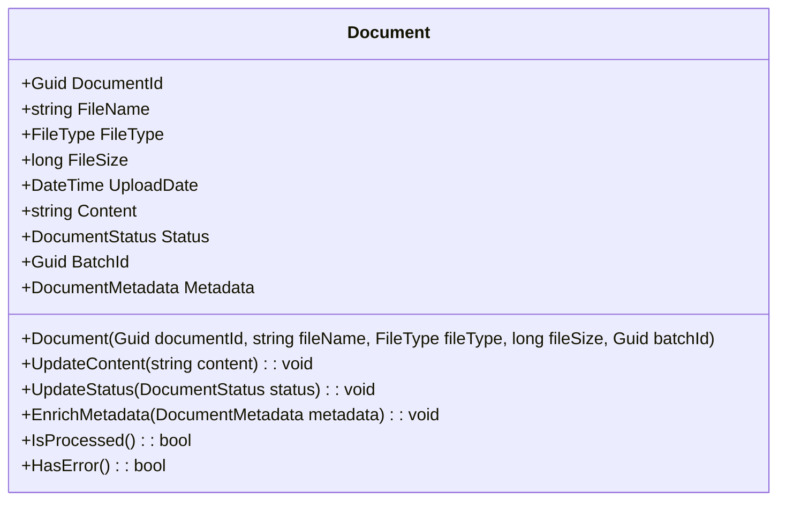

#### Classification Aggregate

```mermaid
classDiagram
    class Classification {
        +Guid ClassificationId
        +Guid DocumentId
        +CategoryType Category
        +RiskLevel RiskLevel
        +string Summary
        +DateTime ClassificationDate
        +string ClassifiedBy
        +decimal ConfidenceScore
        +bool IsOverridden
        +Classification(Guid classificationId, Guid documentId, CategoryType category, RiskLevel riskLevel, string summary, string classifiedBy, decimal confidenceScore)
        +Override(CategoryType category, RiskLevel riskLevel, string summary, string overriddenBy): void
        +IsHighRisk(): bool
        +IsLowConfidence(): bool
    }
```

## Conclusion

These component diagrams provide a comprehensive view of the structure and relationships between the various components that make up the Compliance Document Classifier system. They illustrate how the components are organized and how they interact with each other to provide the system's functionality.