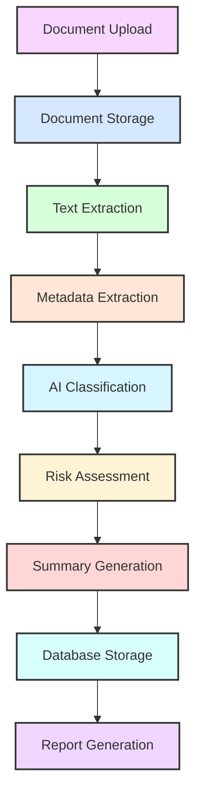
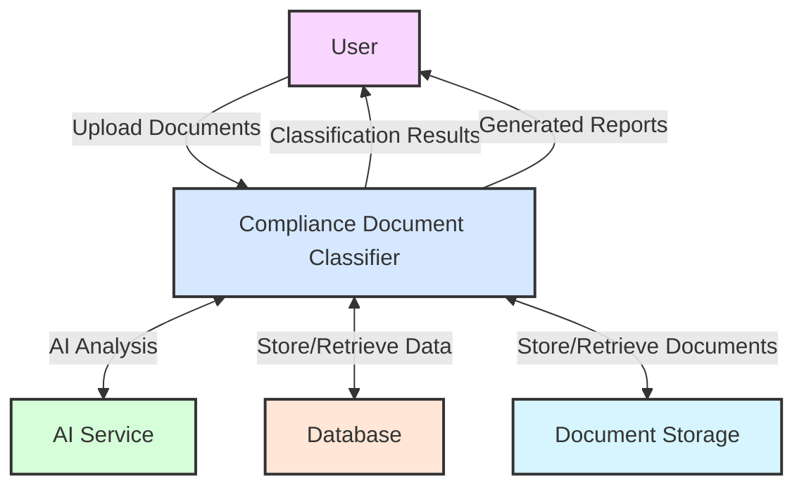
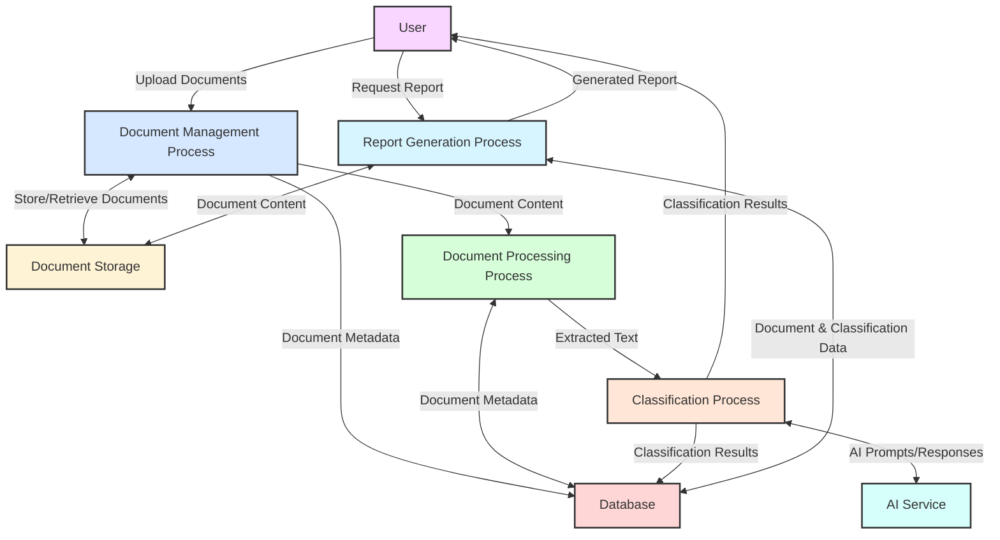
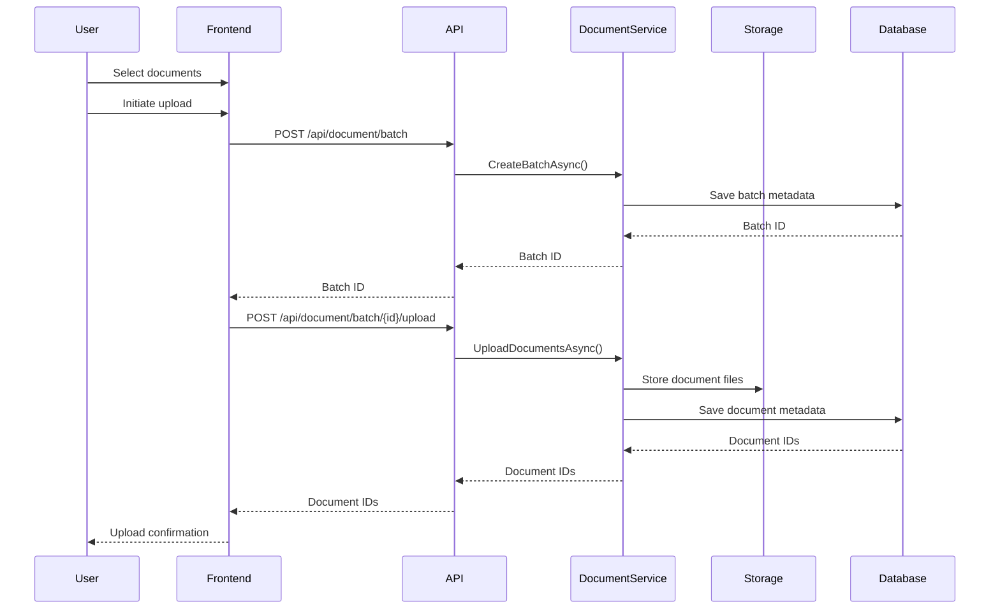
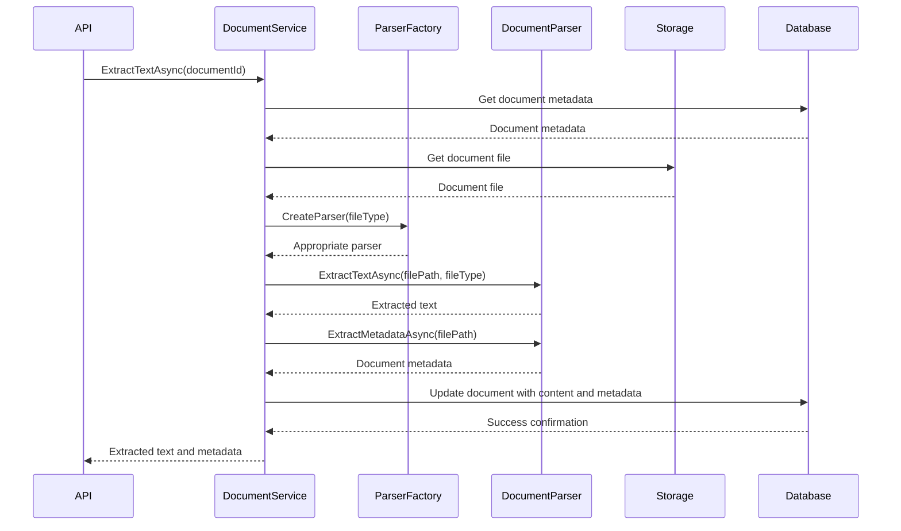
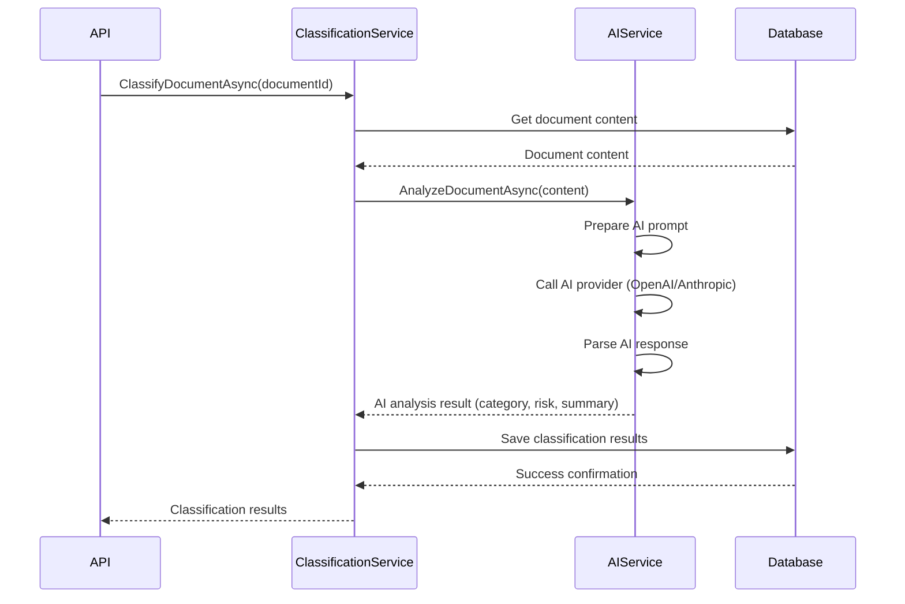
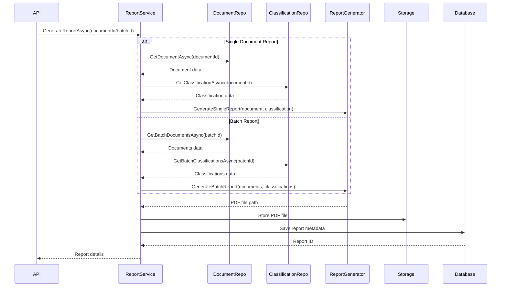
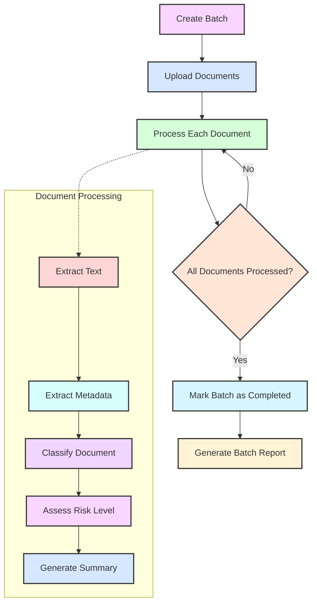
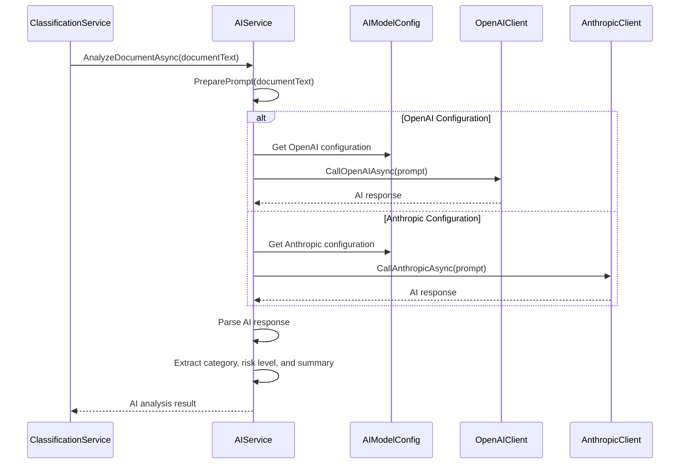

# Compliance Document Classifier - Data Flow Diagrams

## Overview

This document provides detailed data flow diagrams for the Compliance Document Classifier's document processing pipeline. These diagrams illustrate how data moves through the system, from document upload to classification and report generation.

## Document Processing Pipeline

The following diagram illustrates the complete document processing pipeline:

## Level 0 Data Flow Diagram

The Level 0 DFD provides a high-level overview of the system:

## Level 1 Data Flow Diagram

The Level 1 DFD breaks down the system into its major processes:

## Document Upload Flow

The following diagram details the document upload process:

## Document Processing Flow

This diagram illustrates the document processing flow:

## Classification Flow

The classification process flow is detailed below:

## Report Generation Flow

The report generation process flow:

## Batch Processing Flow

The batch processing flow:

## Data Store Interactions

This diagram shows how the system interacts with its data stores:

```mermaid
graph TD
    subgraph "Document Storage"
    DS1[File System/Blob Storage]
    end
    
    subgraph "Database"
    DS2[Document Metadata]
    DS3[Classification Results]
    DS4[Batch Information]
    DS5[Report Metadata]
    end
    
    P1[Document Service] <-->|Store/Retrieve Files| DS1
    P1 <-->|Store/Retrieve Metadata| DS2
    P1 <-->|Update Batch Info| DS4
    
    P2[Classification Service] -->|Read Document Content| DS2
    P2 -->|Store Classification Results| DS3
    P2 -->|Update Document Status| DS2
    P2 -->|Update Batch Progress| DS4
    
    P3[Report Service] -->|Read Document Metadata| DS2
    P3 -->|Read Classification Results| DS3
    P3 -->|Read Batch Information| DS4
    P3 -->|Store Report Metadata| DS5
    P3 <-->|Store/Retrieve Report Files| DS1
    
    style DS1 fill:#f9d6ff,stroke:#333,stroke-width:2px
    style DS2 fill:#d6e8ff,stroke:#333,stroke-width:2px
    style DS3 fill:#d6ffd9,stroke:#333,stroke-width:2px
    style DS4 fill:#ffe6d6,stroke:#333,stroke-width:2px
    style DS5 fill:#d6f5ff,stroke:#333,stroke-width:2px
    style P1 fill:#fff3d6,stroke:#333,stroke-width:2px
    style P2 fill:#ffd6d6,stroke:#333,stroke-width:2px
    style P3 fill:#d6fffc,stroke:#333,stroke-width:2px
```

## AI Service Integration Flow

The AI service integration flow:

## Conclusion

These data flow diagrams provide a comprehensive view of how information moves through the Compliance Document Classifier system. They illustrate the key processes, data stores, and interactions that enable the system to ingest, process, classify, and report on compliance documents.