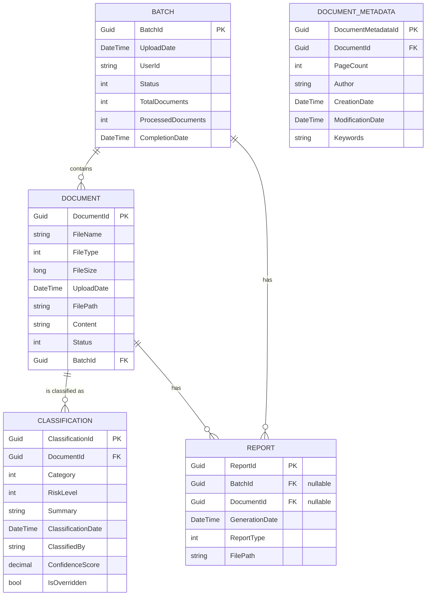

# Compliance Document Classifier - Database Schema

## Overview

This document outlines the database schema design for the Compliance Document Classifier system. The database is designed to store document metadata, classification results, batch information, and report metadata. The actual document files are stored in a file system or blob storage, with references stored in the database.

## Entity Relationship Diagram

The following diagram illustrates the relationships between the main entities in the database:



## Table Definitions

### Document Table

The Document table stores metadata about uploaded documents.

| Column Name | Data Type | Description | Constraints |
|-------------|-----------|-------------|-------------|
| DocumentId | UNIQUEIDENTIFIER | Unique identifier for the document | PRIMARY KEY |
| FileName | NVARCHAR(255) | Original file name | NOT NULL |
| FileType | INT | Type of file (PDF, DOCX, TXT) | NOT NULL |
| FileSize | BIGINT | Size of file in bytes | NOT NULL |
| UploadDate | DATETIME2 | Date and time of upload | NOT NULL |
| FilePath | NVARCHAR(1000) | Path to the stored file | NOT NULL |
| Content | NVARCHAR(MAX) | Extracted text content | NULL |
| Status | INT | Document status (Pending, Processing, Classified, Error) | NOT NULL |
| BatchId | UNIQUEIDENTIFIER | Reference to the batch | FOREIGN KEY |

```sql
CREATE TABLE [dbo].[Document] (
    [DocumentId] UNIQUEIDENTIFIER NOT NULL PRIMARY KEY,
    [FileName] NVARCHAR(255) NOT NULL,
    [FileType] INT NOT NULL,
    [FileSize] BIGINT NOT NULL,
    [UploadDate] DATETIME2 NOT NULL,
    [FilePath] NVARCHAR(1000) NOT NULL,
    [Content] NVARCHAR(MAX) NULL,
    [Status] INT NOT NULL,
    [BatchId] UNIQUEIDENTIFIER NOT NULL,
    CONSTRAINT [FK_Document_Batch] FOREIGN KEY ([BatchId]) REFERENCES [dbo].[Batch] ([BatchId])
);
```

### DocumentMetadata Table

The DocumentMetadata table stores additional metadata extracted from documents.

| Column Name | Data Type | Description | Constraints |
|-------------|-----------|-------------|-------------|
| DocumentMetadataId | UNIQUEIDENTIFIER | Unique identifier for the metadata | PRIMARY KEY |
| DocumentId | UNIQUEIDENTIFIER | Reference to the document | FOREIGN KEY |
| PageCount | INT | Number of pages in the document | NULL |
| Author | NVARCHAR(255) | Author of the document | NULL |
| CreationDate | DATETIME2 | Date the document was created | NULL |
| ModificationDate | DATETIME2 | Date the document was last modified | NULL |
| Keywords | NVARCHAR(1000) | Keywords extracted from the document | NULL |

```sql
CREATE TABLE [dbo].[DocumentMetadata] (
    [DocumentMetadataId] UNIQUEIDENTIFIER NOT NULL PRIMARY KEY,
    [DocumentId] UNIQUEIDENTIFIER NOT NULL,
    [PageCount] INT NULL,
    [Author] NVARCHAR(255) NULL,
    [CreationDate] DATETIME2 NULL,
    [ModificationDate] DATETIME2 NULL,
    [Keywords] NVARCHAR(1000) NULL,
    CONSTRAINT [FK_DocumentMetadata_Document] FOREIGN KEY ([DocumentId]) REFERENCES [dbo].[Document] ([DocumentId]) ON DELETE CASCADE
);
```

### Classification Table

The Classification table stores the results of document classification.

| Column Name | Data Type | Description | Constraints |
|-------------|-----------|-------------|-------------|
| ClassificationId | UNIQUEIDENTIFIER | Unique identifier for the classification | PRIMARY KEY |
| DocumentId | UNIQUEIDENTIFIER | Reference to the document | FOREIGN KEY |
| Category | INT | Category of the document | NOT NULL |
| RiskLevel | INT | Risk level assessment | NOT NULL |
| Summary | NVARCHAR(2000) | AI-generated summary | NOT NULL |
| ClassificationDate | DATETIME2 | Date and time of classification | NOT NULL |
| ClassifiedBy | NVARCHAR(255) | AI model or user for overrides | NOT NULL |
| ConfidenceScore | DECIMAL(5,4) | AI confidence in classification | NOT NULL |
| IsOverridden | BIT | Indicates manual override | NOT NULL |

```sql
CREATE TABLE [dbo].[Classification] (
    [ClassificationId] UNIQUEIDENTIFIER NOT NULL PRIMARY KEY,
    [DocumentId] UNIQUEIDENTIFIER NOT NULL,
    [Category] INT NOT NULL,
    [RiskLevel] INT NOT NULL,
    [Summary] NVARCHAR(2000) NOT NULL,
    [ClassificationDate] DATETIME2 NOT NULL,
    [ClassifiedBy] NVARCHAR(255) NOT NULL,
    [ConfidenceScore] DECIMAL(5,4) NOT NULL,
    [IsOverridden] BIT NOT NULL,
    CONSTRAINT [FK_Classification_Document] FOREIGN KEY ([DocumentId]) REFERENCES [dbo].[Document] ([DocumentId]) ON DELETE CASCADE
);
```

### Batch Table

The Batch table stores information about document batches.

| Column Name | Data Type | Description | Constraints |
|-------------|-----------|-------------|-------------|
| BatchId | UNIQUEIDENTIFIER | Unique identifier for the batch | PRIMARY KEY |
| UploadDate | DATETIME2 | Date and time of batch creation | NOT NULL |
| UserId | NVARCHAR(255) | User who created the batch | NOT NULL |
| Status | INT | Batch status (Pending, Processing, Completed, Error) | NOT NULL |
| TotalDocuments | INT | Total number of documents in the batch | NOT NULL |
| ProcessedDocuments | INT | Number of processed documents | NOT NULL |
| CompletionDate | DATETIME2 | Date and time of batch completion | NULL |

```sql
CREATE TABLE [dbo].[Batch] (
    [BatchId] UNIQUEIDENTIFIER NOT NULL PRIMARY KEY,
    [UploadDate] DATETIME2 NOT NULL,
    [UserId] NVARCHAR(255) NOT NULL,
    [Status] INT NOT NULL,
    [TotalDocuments] INT NOT NULL,
    [ProcessedDocuments] INT NOT NULL,
    [CompletionDate] DATETIME2 NULL
);
```

### Report Table

The Report table stores information about generated reports.

| Column Name | Data Type | Description | Constraints |
|-------------|-----------|-------------|-------------|
| ReportId | UNIQUEIDENTIFIER | Unique identifier for the report | PRIMARY KEY |
| BatchId | UNIQUEIDENTIFIER | Reference to the batch (for batch reports) | NULL, FOREIGN KEY |
| DocumentId | UNIQUEIDENTIFIER | Reference to the document (for single document reports) | NULL, FOREIGN KEY |
| GenerationDate | DATETIME2 | Date and time of report generation | NOT NULL |
| ReportType | INT | Type of report (SingleDocument, BatchSummary) | NOT NULL |
| FilePath | NVARCHAR(1000) | Path to the generated PDF file | NOT NULL |

```sql
CREATE TABLE [dbo].[Report] (
    [ReportId] UNIQUEIDENTIFIER NOT NULL PRIMARY KEY,
    [BatchId] UNIQUEIDENTIFIER NULL,
    [DocumentId] UNIQUEIDENTIFIER NULL,
    [GenerationDate] DATETIME2 NOT NULL,
    [ReportType] INT NOT NULL,
    [FilePath] NVARCHAR(1000) NOT NULL,
    CONSTRAINT [FK_Report_Batch] FOREIGN KEY ([BatchId]) REFERENCES [dbo].[Batch] ([BatchId]),
    CONSTRAINT [FK_Report_Document] FOREIGN KEY ([DocumentId]) REFERENCES [dbo].[Document] ([DocumentId]),
    CONSTRAINT [CK_Report_BatchOrDocument] CHECK (([BatchId] IS NOT NULL AND [DocumentId] IS NULL) OR ([BatchId] IS NULL AND [DocumentId] IS NOT NULL))
);
```

## Indexes

The following indexes are recommended to optimize query performance:

### Document Table Indexes

```sql
CREATE INDEX [IX_Document_BatchId] ON [dbo].[Document] ([BatchId]);
CREATE INDEX [IX_Document_Status] ON [dbo].[Document] ([Status]);
CREATE INDEX [IX_Document_UploadDate] ON [dbo].[Document] ([UploadDate]);
```

### Classification Table Indexes

```sql
CREATE UNIQUE INDEX [IX_Classification_DocumentId] ON [dbo].[Classification] ([DocumentId]);
CREATE INDEX [IX_Classification_Category] ON [dbo].[Classification] ([Category]);
CREATE INDEX [IX_Classification_RiskLevel] ON [dbo].[Classification] ([RiskLevel]);
```

### Batch Table Indexes

```sql
CREATE INDEX [IX_Batch_Status] ON [dbo].[Batch] ([Status]);
CREATE INDEX [IX_Batch_UploadDate] ON [dbo].[Batch] ([UploadDate]);
CREATE INDEX [IX_Batch_UserId] ON [dbo].[Batch] ([UserId]);
```

### Report Table Indexes

```sql
CREATE INDEX [IX_Report_BatchId] ON [dbo].[Report] ([BatchId]);
CREATE INDEX [IX_Report_DocumentId] ON [dbo].[Report] ([DocumentId]);
CREATE INDEX [IX_Report_GenerationDate] ON [dbo].[Report] ([GenerationDate]);
```

## Enum Mappings

The database uses integer values to represent enum values. Here are the mappings:

### FileType Enum

| Value | Description |
|-------|-------------|
| 0 | PDF |
| 1 | DOCX |
| 2 | TXT |

### DocumentStatus Enum

| Value | Description |
|-------|-------------|
| 0 | Pending |
| 1 | Processing |
| 2 | Classified |
| 3 | Error |

### CategoryType Enum

| Value | Description |
|-------|-------------|
| 0 | DataPrivacy |
| 1 | FinancialReporting |
| 2 | WorkplaceConduct |
| 3 | HealthCompliance |
| 4 | Other |

### RiskLevel Enum

| Value | Description |
|-------|-------------|
| 0 | Low |
| 1 | Medium |
| 2 | High |

### BatchStatus Enum

| Value | Description |
|-------|-------------|
| 0 | Pending |
| 1 | Processing |
| 2 | Completed |
| 3 | Error |

### ReportType Enum

| Value | Description |
|-------|-------------|
| 0 | SingleDocument |
| 1 | BatchSummary |

## Data Access Layer

The data access layer uses the Repository pattern to abstract database operations. Each aggregate has its own repository interface:

- `IDocumentRepository`: For Document aggregate operations
- `IClassificationRepository`: For Classification aggregate operations
- `IBatchRepository`: For Batch aggregate operations
- `IReportRepository`: For Report aggregate operations

These repositories are implemented using Entity Framework Core, which maps the domain entities to the database tables.

## Entity Framework Core Configuration

Entity Framework Core is configured using the Fluent API to map the domain entities to the database schema. Here's an example of the Document entity configuration:

```csharp
public class DocumentConfiguration : IEntityTypeConfiguration<Document>
{
    public void Configure(EntityTypeBuilder<Document> builder)
    {
        builder.ToTable("Document");
        
        builder.HasKey(d => d.DocumentId);
        
        builder.Property(d => d.FileName)
            .IsRequired()
            .HasMaxLength(255);
            
        builder.Property(d => d.FileType)
            .IsRequired();
            
        builder.Property(d => d.FileSize)
            .IsRequired();
            
        builder.Property(d => d.UploadDate)
            .IsRequired();
            
        builder.Property(d => d.FilePath)
            .IsRequired()
            .HasMaxLength(1000);
            
        builder.Property(d => d.Status)
            .IsRequired();
            
        builder.HasOne<Batch>()
            .WithMany()
            .HasForeignKey(d => d.BatchId)
            .IsRequired();
            
        builder.OwnsOne(d => d.Metadata, metadata =>
        {
            metadata.ToTable("DocumentMetadata");
            
            metadata.WithOwner().HasForeignKey("DocumentId");
            
            metadata.Property(m => m.PageCount);
            metadata.Property(m => m.Author).HasMaxLength(255);
            metadata.Property(m => m.CreationDate);
            metadata.Property(m => m.ModificationDate);
            metadata.Property(m => m.Keywords).HasMaxLength(1000);
        });
    }
}
```

## Conclusion

The database schema is designed to support the core functionality of the Compliance Document Classifier system. It provides a structured way to store document metadata, classification results, batch information, and report metadata. The schema is optimized for query performance and data integrity, with appropriate indexes and constraints.