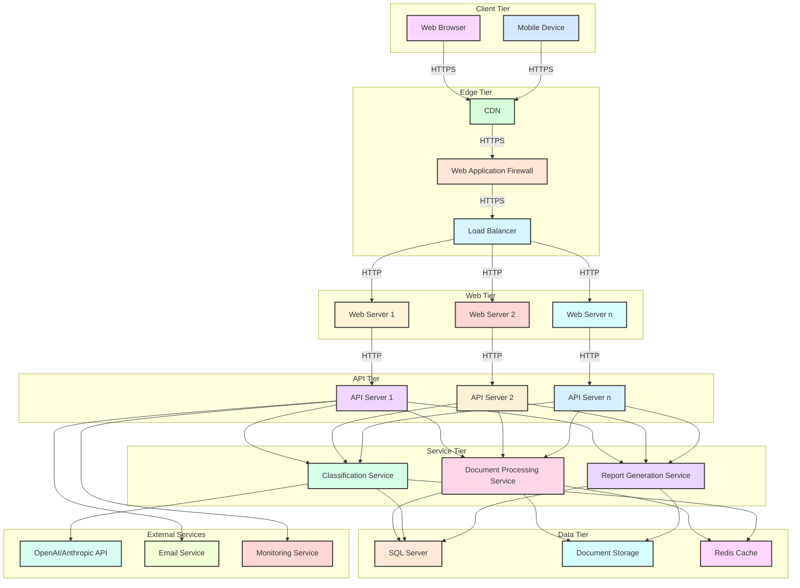
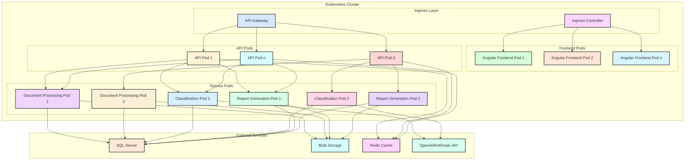
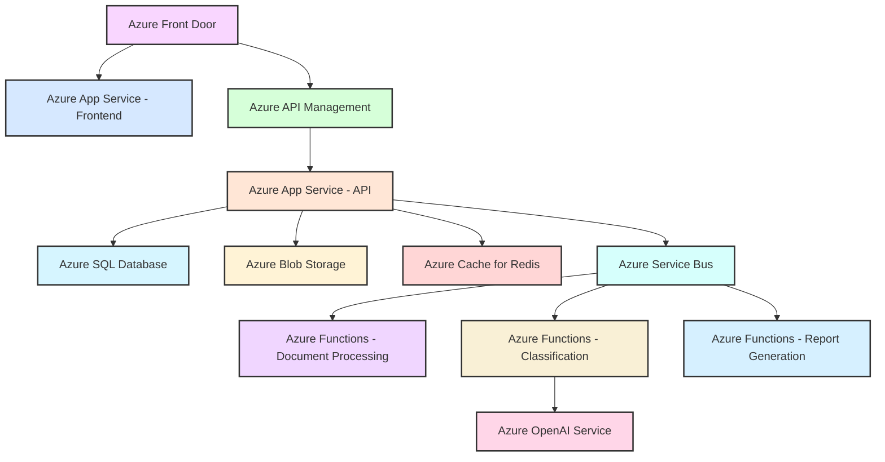
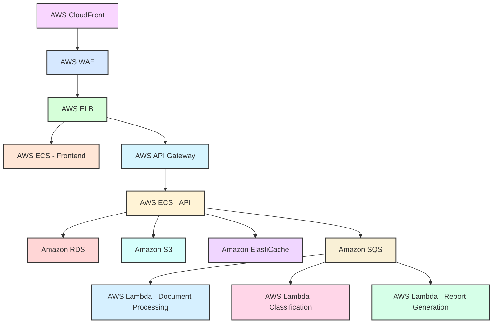
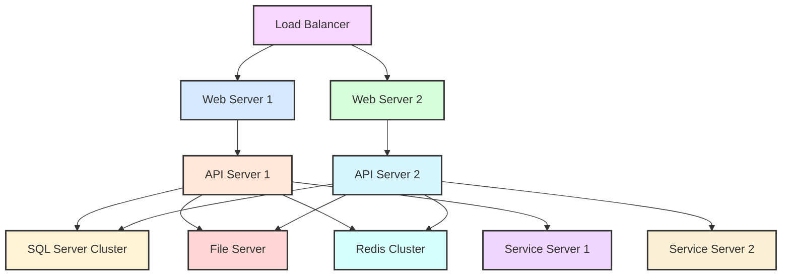
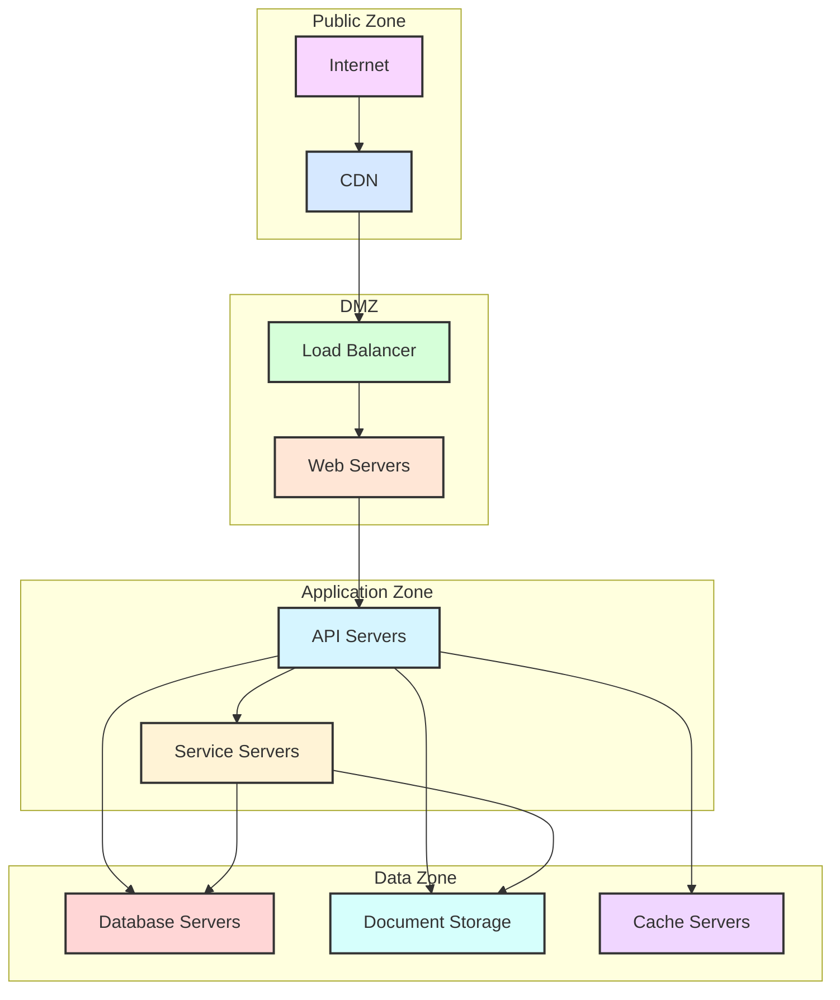

# Compliance Document Classifier - Deployment Architecture

## Overview

This document outlines the deployment architecture and infrastructure requirements for the Compliance Document Classifier system. It provides guidance on how to deploy the system in various environments, from development to production, and details the infrastructure components required for a robust, scalable, and secure deployment.

## Deployment Environments

The Compliance Document Classifier system is designed to be deployed across multiple environments:

1. **Development Environment**: For individual developers to build and test features
2. **Testing Environment**: For QA and automated testing
3. **Staging Environment**: For pre-production validation
4. **Production Environment**: For end-user access

## Infrastructure Components

The following diagram illustrates the high-level infrastructure components required for a production deployment:



## Component Specifications

### Client Tier

| Component | Description | Requirements |
|-----------|-------------|--------------|
| Web Browser | Client application accessed via web browser | Modern browsers (Chrome, Firefox, Safari, Edge) with JavaScript enabled |
| Mobile Device | Optional mobile access via responsive web design | iOS 14+ or Android 10+ |

### Edge Tier

| Component | Description | Requirements |
|-----------|-------------|--------------|
| CDN | Content Delivery Network for static assets | Azure CDN, AWS CloudFront, or similar |
| Web Application Firewall | Protects against web application attacks | Azure WAF, AWS WAF, or similar |
| Load Balancer | Distributes traffic across web servers | Azure Load Balancer, AWS ELB, or similar |

### Web Tier

| Component | Description | Requirements |
|-----------|-------------|--------------|
| Web Servers | Hosts the Angular frontend application | - 2+ servers for high availability<br>- 2 vCPUs, 4 GB RAM per server<br>- 50 GB SSD storage<br>- Nginx or similar web server |

### API Tier

| Component | Description | Requirements |
|-----------|-------------|--------------|
| API Servers | Hosts the .NET Core Web API | - 2+ servers for high availability<br>- 4 vCPUs, 8 GB RAM per server<br>- 100 GB SSD storage<br>- .NET Core 8 runtime |

### Service Tier

| Component | Description | Requirements |
|-----------|-------------|--------------|
| Document Processing Service | Handles document parsing and text extraction | - 2+ servers for high availability<br>- 4 vCPUs, 8 GB RAM per server<br>- 100 GB SSD storage |
| Classification Service | Manages AI-based document classification | - 2+ servers for high availability<br>- 4 vCPUs, 8 GB RAM per server<br>- 50 GB SSD storage |
| Report Generation Service | Generates PDF reports | - 2+ servers for high availability<br>- 4 vCPUs, 8 GB RAM per server<br>- 100 GB SSD storage |

### Data Tier

| Component | Description | Requirements |
|-----------|-------------|--------------|
| SQL Server | Stores document metadata, classifications, and report metadata | - Primary and secondary instances for high availability<br>- 8 vCPUs, 32 GB RAM per instance<br>- 500 GB SSD storage<br>- SQL Server 2019 or later |
| Document Storage | Stores document files | - Blob storage or file system<br>- 1 TB storage capacity<br>- Backup and replication configured |
| Redis Cache | Caches frequently accessed data | - 2+ nodes for high availability<br>- 2 vCPUs, 4 GB RAM per node |

### External Services

| Component | Description | Requirements |
|-----------|-------------|--------------|
| OpenAI/Anthropic API | AI services for document classification | - API access configured<br>- Rate limiting considered |
| Email Service | Sends notifications and reports | - SMTP service or email API<br>- Proper authentication configured |
| Monitoring Service | Monitors system health and performance | - Application Performance Monitoring (APM) solution<br>- Log aggregation service |

## Containerized Deployment

The Compliance Document Classifier system can be deployed using containers for improved scalability and portability. The following diagram illustrates a containerized deployment architecture using Kubernetes:



### Container Specifications

| Container | Description | Resource Requirements |
|-----------|-------------|------------------------|
| Angular Frontend | Hosts the Angular frontend application | - 0.5 vCPU<br>- 1 GB RAM<br>- 250 MB storage |
| API | Hosts the .NET Core Web API | - 1 vCPU<br>- 2 GB RAM<br>- 500 MB storage |
| Document Processing | Handles document parsing and text extraction | - 1 vCPU<br>- 2 GB RAM<br>- 500 MB storage |
| Classification | Manages AI-based document classification | - 1 vCPU<br>- 2 GB RAM<br>- 250 MB storage |
| Report Generation | Generates PDF reports | - 1 vCPU<br>- 2 GB RAM<br>- 500 MB storage |

## Cloud Deployment Options

The Compliance Document Classifier system can be deployed to various cloud platforms:

### Microsoft Azure



| Azure Component | Purpose |
|-----------------|---------|
| Azure Front Door | Global load balancing, WAF, and CDN |
| Azure App Service | Hosting for frontend and API applications |
| Azure API Management | API gateway and management |
| Azure SQL Database | Relational database for metadata |
| Azure Blob Storage | Document file storage |
| Azure Cache for Redis | Distributed caching |
| Azure Service Bus | Message queue for asynchronous processing |
| Azure Functions | Serverless compute for document processing, classification, and report generation |
| Azure OpenAI Service | AI service for document classification |

### Amazon Web Services (AWS)



| AWS Component | Purpose |
|---------------|---------|
| AWS CloudFront | Content delivery network |
| AWS WAF | Web application firewall |
| AWS ELB | Elastic Load Balancer |
| AWS ECS | Elastic Container Service for hosting applications |
| AWS API Gateway | API management |
| Amazon RDS | Relational database for metadata |
| Amazon S3 | Document file storage |
| Amazon ElastiCache | Distributed caching |
| Amazon SQS | Simple Queue Service for asynchronous processing |
| AWS Lambda | Serverless compute for document processing, classification, and report generation |

## On-Premises Deployment

For organizations with specific compliance requirements, the system can be deployed on-premises:



## Network Requirements

### Network Topology



### Network Security

| Zone | Security Measures |
|------|-------------------|
| Public Zone | - DDoS protection<br>- IP filtering |
| DMZ | - Web Application Firewall<br>- Intrusion Detection System<br>- Limited inbound ports (80/443) |
| Application Zone | - Internal firewall<br>- Network segmentation<br>- No direct internet access |
| Data Zone | - Internal firewall<br>- Network segmentation<br>- Encrypted communications<br>- No direct internet access |

## Scalability Considerations

The Compliance Document Classifier system is designed to scale horizontally to handle increased load:

### Frontend Scaling

- Auto-scaling based on CPU utilization and request count
- Load balancing across multiple instances
- CDN for static content delivery

### API Scaling

- Auto-scaling based on CPU utilization and request count
- Load balancing across multiple instances
- Rate limiting to prevent abuse

### Service Scaling

- Auto-scaling based on queue length and CPU utilization
- Independent scaling for each service type
- Batch processing for efficiency

### Database Scaling

- Read replicas for read-heavy workloads
- Sharding for very large datasets
- Connection pooling for efficient resource utilization

## High Availability and Disaster Recovery

### High Availability

- Multiple instances of each component across availability zones
- Load balancing for traffic distribution
- Health checks and automatic failover
- Database clustering or replication

### Disaster Recovery

| Component | Recovery Strategy | RPO | RTO |
|-----------|-------------------|-----|-----|
| Frontend | Multiple regions with DNS failover | < 5 minutes | < 5 minutes |
| API | Multiple regions with DNS failover | < 5 minutes | < 5 minutes |
| Database | Geo-replication with automatic failover | < 5 minutes | < 15 minutes |
| Document Storage | Geo-replication | < 5 minutes | < 15 minutes |

### Backup Strategy

| Data Type | Backup Frequency | Retention Period | Backup Method |
|-----------|------------------|------------------|---------------|
| Database | Daily full, hourly differential | 30 days | Automated database backups |
| Document Files | Daily | 30 days | Blob storage snapshots |
| Configuration | After changes | 90 days | Infrastructure as Code (IaC) repository |

## Monitoring and Operations

### Monitoring Components

| Component | Metrics to Monitor | Alerting Thresholds |
|-----------|-------------------|---------------------|
| Web Servers | - CPU utilization<br>- Memory usage<br>- Request count<br>- Error rate | - CPU > 80% for 5 minutes<br>- Memory > 85% for 5 minutes<br>- Error rate > 1% for 5 minutes |
| API Servers | - CPU utilization<br>- Memory usage<br>- Request count<br>- Response time<br>- Error rate | - CPU > 80% for 5 minutes<br>- Memory > 85% for 5 minutes<br>- Response time > 500ms for 5 minutes<br>- Error rate > 1% for 5 minutes |
| Database | - CPU utilization<br>- Memory usage<br>- Connection count<br>- Query performance<br>- Storage usage | - CPU > 80% for 5 minutes<br>- Memory > 85% for 5 minutes<br>- Storage > 85% capacity<br>- Slow queries > 1 second |
| Document Storage | - Storage usage<br>- Request count<br>- Error rate | - Storage > 85% capacity<br>- Error rate > 1% for 5 minutes |

### Logging Strategy

| Component | Log Types | Log Storage |
|-----------|-----------|-------------|
| Web Servers | - Access logs<br>- Error logs<br>- Performance logs | Centralized log management system |
| API Servers | - Request logs<br>- Error logs<br>- Performance logs<br>- Security logs | Centralized log management system |
| Services | - Processing logs<br>- Error logs<br>- Performance logs | Centralized log management system |
| Database | - Query logs<br>- Error logs<br>- Performance logs | Centralized log management system |

## Deployment Process

### CI/CD Pipeline

```mermaid
graph LR
    A[Source Code] --> B[Build]
    B --> C[Unit Tests]
    C --> D[Static Analysis]
    D --> E[Package]
    E --> F[Deploy to Dev]
    F --> G[Integration Tests]
    G --> H[Deploy to Test]
    H --> I[Acceptance Tests]
    I --> J[Deploy to Staging]
    J --> K[Performance Tests]
    K --> L[Deploy to Production]
    
    style A fill:#f9d6ff,stroke:#333,stroke-width:2px
    style B fill:#d6e8ff,stroke:#333,stroke-width:2px
    style C fill:#d6ffd9,stroke:#333,stroke-width:2px
    style D fill:#ffe6d6,stroke:#333,stroke-width:2px
    style E fill:#d6f5ff,stroke:#333,stroke-width:2px
    style F fill:#fff3d6,stroke:#333,stroke-width:2px
    style G fill:#ffd6d6,stroke:#333,stroke-width:2px
    style H fill:#d6fffc,stroke:#333,stroke-width:2px
    style I fill:#f0d6ff,stroke:#333,stroke-width:2px
    style J fill:#f9f0d6,stroke:#333,stroke-width:2px
    style K fill:#d6f0ff,stroke:#333,stroke-width:2px
    style L fill:#ffd6e8,stroke:#333,stroke-width:2px
```



### Deployment Checklist

1. **Pre-Deployment**
   - Review and approve changes
   - Verify all tests pass
   - Check infrastructure readiness
   - Notify stakeholders

2. **Deployment**
   - Deploy database changes
   - Deploy application components
   - Verify deployment success
   - Run smoke tests

3. **Post-Deployment**
   - Monitor application health
   - Verify functionality
   - Check performance metrics
   - Update documentation

## Infrastructure as Code

The infrastructure for the Compliance Document Classifier system is managed using Infrastructure as Code (IaC) tools:

### Azure Resource Manager (ARM) Template Example

```json
{
  "$schema": "https://schema.management.azure.com/schemas/2019-04-01/deploymentTemplate.json#",
  "contentVersion": "1.0.0.0",
  "parameters": {
    "appServicePlanName": {
      "type": "string",
      "defaultValue": "compliance-classifier-plan"
    },
    "webAppName": {
      "type": "string",
      "defaultValue": "compliance-classifier-web"
    },
    "apiAppName": {
      "type": "string",
      "defaultValue": "compliance-classifier-api"
    },
    "sqlServerName": {
      "type": "string",
      "defaultValue": "compliance-classifier-sql"
    },
    "sqlDatabaseName": {
      "type": "string",
      "defaultValue": "ComplianceClassifier"
    },
    "storageAccountName": {
      "type": "string",
      "defaultValue": "complianceclassifierstorage"
    }
  },
  "resources": [
    {
      "type": "Microsoft.Web/serverfarms",
      "apiVersion": "2020-12-01",
      "name": "[parameters('appServicePlanName')]",
      "location": "[resourceGroup().location]",
      "sku": {
        "name": "P1v2",
        "tier": "PremiumV2",
        "size": "P1v2",
        "family": "Pv2",
        "capacity": 1
      },
      "kind": "app",
      "properties": {
        "perSiteScaling": false,
        "reserved": false
      }
    },
    {
      "type": "Microsoft.Web/sites",
      "apiVersion": "2020-12-01",
      "name": "[parameters('webAppName')]",
      "location": "[resourceGroup().location]",
      "dependsOn": [
        "[resourceId('Microsoft.Web/serverfarms', parameters('appServicePlanName'))]"
      ],
      "kind": "app",
      "properties": {
        "serverFarmId": "[resourceId('Microsoft.Web/serverfarms', parameters('appServicePlanName'))]",
        "httpsOnly": true
      }
    },
    {
      "type": "Microsoft.Web/sites",
      "apiVersion": "2020-12-01",
      "name": "[parameters('apiAppName')]",
      "location": "[resourceGroup().location]",
      "dependsOn": [
        "[resourceId('Microsoft.Web/serverfarms', parameters('appServicePlanName'))]"
      ],
      "kind": "api",
      "properties": {
        "serverFarmId": "[resourceId('Microsoft.Web/serverfarms', parameters('appServicePlanName'))]",
        "httpsOnly": true
      }
    },
    {
      "type": "Microsoft.Sql/servers",
      "apiVersion": "2020-11-01-preview",
      "name": "[parameters('sqlServerName')]",
      "location": "[resourceGroup().location]",
      "properties": {
        "administratorLogin": "sqladmin",
        "administratorLoginPassword": "[newGuid()]"
      },
      "resources": [
        {
          "type": "databases",
          "apiVersion": "2020-11-01-preview",
          "name": "[parameters('sqlDatabaseName')]",
          "location": "[resourceGroup().location]",
          "dependsOn": [
            "[resourceId('Microsoft.Sql/servers', parameters('sqlServerName'))]"
          ],
          "sku": {
            "name": "Standard",
            "tier": "Standard"
          },
          "properties": {
            "collation": "SQL_Latin1_General_CP1_CI_AS",
            "maxSizeBytes": 1073741824
          }
        }
      ]
    },
    {
      "type": "Microsoft.Storage/storageAccounts",
      "apiVersion": "2021-04-01",
      "name": "[parameters('storageAccountName')]",
      "location": "[resourceGroup().location]",
      "sku": {
        "name": "Standard_LRS"
      },
      "kind": "StorageV2",
      "properties": {
        "supportsHttpsTrafficOnly": true,
        "encryption": {
          "services": {
            "file": {
              "keyType": "Account",
              "enabled": true
            },
            "blob": {
              "keyType": "Account",
              "enabled": true
            }
          },
          "keySource": "Microsoft.Storage"
        }
      }
    }
  ],
  "outputs": {
    "webAppUrl": {
      "type": "string",
      "value": "[concat('https://', reference(resourceId('Microsoft.Web/sites', parameters('webAppName'))).defaultHostName)]"
    },
    "apiAppUrl": {
      "type": "string",
      "value": "[concat('https://', reference(resourceId('Microsoft.Web/sites', parameters('apiAppName'))).defaultHostName)]"
    }
  }
}
```

## Conclusion

The deployment architecture outlined in this document provides a robust, scalable, and secure foundation for the Compliance Document Classifier system. By following the infrastructure requirements and deployment processes described here, organizations can successfully deploy the system in various environments, from development to production.

The architecture supports both cloud and on-premises deployments, with options for containerization and serverless computing. The system is designed to scale horizontally to handle increased load and provides high availability and disaster recovery capabilities to ensure business continuity.