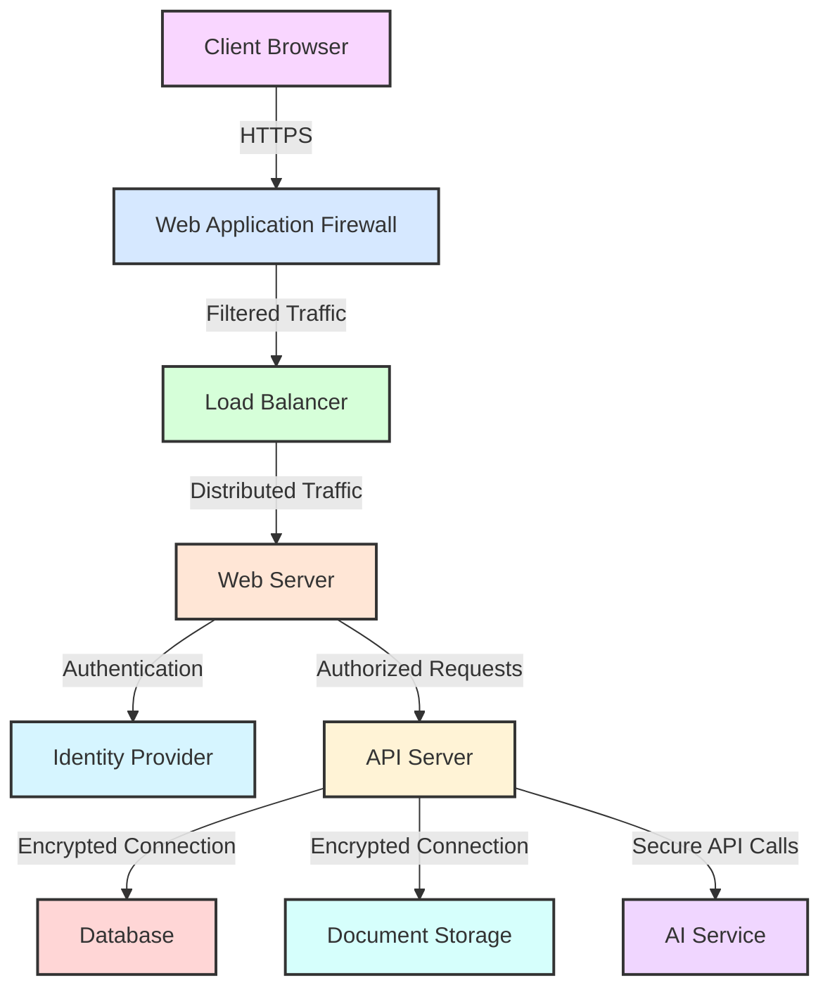

# Compliance Document Classifier - Security Considerations

## Overview

This document outlines the security design and implementation details for the Compliance Document Classifier system. Security is a critical aspect of the system, especially given that it processes potentially sensitive compliance documents. The security measures described here are designed to protect data confidentiality, integrity, and availability throughout the system.

## Security Architecture

The Compliance Document Classifier implements a defense-in-depth security strategy with multiple layers of protection:



## Authentication and Authorization

### Authentication

The system uses JWT (JSON Web Token) based authentication:

1. **Token Generation**: When a user logs in successfully, the system generates a JWT token containing:
   - User identity (sub claim)
   - Token expiration time (exp claim)
   - Token issuance time (iat claim)
   - Issuer information (iss claim)
   - Audience information (aud claim)

2. **Token Validation**: For each request, the system validates:
   - Token signature using the secret key
   - Token expiration
   - Token issuer and audience
   - Token structure and claims

3. **Token Refresh**: Tokens have a limited lifetime (typically 15-30 minutes) and can be refreshed using a refresh token with a longer lifetime (typically 24 hours).

```csharp
// JWT Authentication Configuration
services.AddAuthentication(options =>
{
    options.DefaultAuthenticateScheme = JwtBearerDefaults.AuthenticationScheme;
    options.DefaultChallengeScheme = JwtBearerDefaults.AuthenticationScheme;
})
.AddJwtBearer(options =>
{
    options.TokenValidationParameters = new TokenValidationParameters
    {
        ValidateIssuer = true,
        ValidateAudience = true,
        ValidateLifetime = true,
        ValidateIssuerSigningKey = true,
        ValidIssuer = Configuration["Jwt:Issuer"],
        ValidAudience = Configuration["Jwt:Audience"],
        IssuerSigningKey = new SymmetricSecurityKey(
            Encoding.UTF8.GetBytes(Configuration["Jwt:Key"]))
    };
});
```

### Authorization

The system implements role-based access control (RBAC):

1. **User Roles**:
   - **Admin**: Full access to all system features
   - **Compliance Officer**: Access to document classification and reporting
   - **Document Manager**: Access to document upload and management
   - **Viewer**: Read-only access to documents and classifications

2. **Permission Enforcement**:
   - Controller-level authorization using `[Authorize]` attributes
   - Action-level authorization using role-based policies
   - Resource-level authorization using custom authorization handlers

```csharp
// Role-based Authorization
services.AddAuthorization(options =>
{
    options.AddPolicy("RequireAdminRole", policy => 
        policy.RequireRole("Admin"));
        
    options.AddPolicy("RequireComplianceOfficerRole", policy => 
        policy.RequireRole("Admin", "ComplianceOfficer"));
        
    options.AddPolicy("RequireDocumentManagerRole", policy => 
        policy.RequireRole("Admin", "DocumentManager"));
});

// Controller with Authorization
[Authorize(Policy = "RequireComplianceOfficerRole")]
[ApiController]
[Route("api/[controller]")]
public class ClassificationController : ControllerBase
{
    // Controller actions
}
```

## Data Protection

### Data at Rest

1. **Database Encryption**:
   - Transparent Data Encryption (TDE) for SQL Server
   - Column-level encryption for sensitive fields
   - Secure key management using Azure Key Vault or similar service

2. **Document Storage Encryption**:
   - Server-side encryption for document files
   - Unique encryption keys for each document
   - Key rotation policies

### Data in Transit

1. **Transport Layer Security**:
   - HTTPS with TLS 1.3 for all communications
   - Strong cipher suites
   - Perfect Forward Secrecy (PFS)
   - HTTP Strict Transport Security (HSTS)

2. **API Communication**:
   - Encrypted communication with external AI services
   - Mutual TLS for service-to-service communication
   - API keys and secrets managed securely

### Data Processing

1. **Memory Protection**:
   - Secure handling of sensitive data in memory
   - Clearing sensitive data after use
   - Protection against memory dumps

2. **Secure Document Parsing**:
   - Input validation for all document types
   - Sandboxed execution environment for document parsing
   - Resource limits to prevent DoS attacks

## Input Validation and Output Encoding

### Input Validation

1. **Document Validation**:
   - File type validation (only allowing .txt, .pdf, .docx)
   - File size limits (e.g., maximum 10MB)
   - Content validation for text extraction
   - Malware scanning

2. **API Input Validation**:
   - Model validation using data annotations
   - Request filtering
   - JSON schema validation

```csharp
// Model Validation
public class ClassificationOverrideDto
{
    [Required]
    [EnumDataType(typeof(CategoryType))]
    public string Category { get; set; }
    
    [Required]
    [EnumDataType(typeof(RiskLevel))]
    public string RiskLevel { get; set; }
    
    [MaxLength(2000)]
    public string Summary { get; set; }
}

// Controller Action with Validation
[HttpPut("{classificationId}/override")]
public async Task<ActionResult<ClassificationDto>> OverrideClassification(
    Guid classificationId, 
    [FromBody] ClassificationOverrideDto overrideDto)
{
    if (!ModelState.IsValid)
    {
        return BadRequest(ModelState);
    }
    
    // Process valid input
}
```

### Output Encoding

1. **HTML Encoding**:
   - Encoding user-generated content before display
   - Content Security Policy (CSP) headers
   - X-XSS-Protection headers

2. **JSON Encoding**:
   - Proper serialization of special characters
   - Avoiding JSON injection vulnerabilities

## Secure File Handling

1. **Upload Security**:
   - Randomized file names to prevent path traversal
   - File type verification using content inspection
   - Virus/malware scanning
   - Quarantine for suspicious files

2. **Storage Security**:
   - Isolated storage containers
   - Least privilege access to storage
   - Audit logging for all file operations

```csharp
// Secure File Upload
public async Task<IActionResult> UploadFile(IFormFile file)
{
    // Validate file type
    var allowedTypes = new[] { ".pdf", ".docx", ".txt" };
    var extension = Path.GetExtension(file.FileName).ToLowerInvariant();
    
    if (!allowedTypes.Contains(extension))
    {
        return BadRequest("Invalid file type");
    }
    
    // Validate file size
    if (file.Length > 10 * 1024 * 1024) // 10MB
    {
        return BadRequest("File too large");
    }
    
    // Generate secure filename
    var secureFileName = $"{Guid.NewGuid()}{extension}";
    var filePath = Path.Combine(_storageConfig.Path, secureFileName);
    
    // Save file
    using (var stream = new FileStream(filePath, FileMode.Create))
    {
        await file.CopyToAsync(stream);
    }
    
    // Scan file for malware (implementation depends on scanning service)
    var scanResult = await _malwareScanner.ScanFileAsync(filePath);
    if (!scanResult.IsClean)
    {
        // Delete infected file
        System.IO.File.Delete(filePath);
        return BadRequest("File contains malware");
    }
    
    // Process clean file
    // ...
}
```

## API Security

1. **Rate Limiting**:
   - Per-user rate limits
   - IP-based rate limits
   - Graduated response to excessive requests

2. **API Key Management**:
   - Secure storage of API keys
   - Regular key rotation
   - Least privilege principle for API keys

3. **Request Validation**:
   - Request size limits
   - Request timeout policies
   - Validation of content types

```csharp
// Rate Limiting Middleware Configuration
services.AddRateLimiter(options =>
{
    options.GlobalLimiter = PartitionedRateLimiter.Create<HttpContext, string>(context =>
    {
        // Rate limit by authenticated user or IP address
        var identifier = context.User?.Identity?.IsAuthenticated == true
            ? context.User.Identity.Name
            : context.Connection.RemoteIpAddress?.ToString();
            
        return RateLimitPartition.GetFixedWindowLimiter(
            identifier ?? "anonymous",
            factory => new FixedWindowRateLimiterOptions
            {
                PermitLimit = 100,
                Window = TimeSpan.FromMinutes(1)
            });
    });
    
    options.OnRejected = async (context, token) =>
    {
        context.HttpContext.Response.StatusCode = StatusCodes.Status429TooManyRequests;
        await context.HttpContext.Response.WriteAsync("Too many requests. Please try again later.", token);
    };
});
```

## AI Service Security

1. **Prompt Injection Prevention**:
   - Input sanitization for AI prompts
   - Parameterized prompt templates
   - Validation of AI responses

2. **AI Provider Security**:
   - Secure API key management
   - Encrypted communication
   - Data minimization in requests

3. **Response Validation**:
   - Validation of AI-generated content
   - Filtering of inappropriate content
   - Handling of unexpected responses

```csharp
// Secure AI Service Implementation
public async Task<AIAnalysisResult> AnalyzeDocumentAsync(string documentText)
{
    // Sanitize input
    var sanitizedText = SanitizeInput(documentText);
    
    // Use parameterized prompt template
    var prompt = _modelConfig.PromptTemplate
        .Replace("{document_text}", sanitizedText);
    
    // Call AI service with secure handling
    string response;
    try
    {
        if (_modelConfig.ModelName.StartsWith("gpt"))
        {
            response = await CallOpenAIAsync(prompt);
        }
        else if (_modelConfig.ModelName.StartsWith("claude"))
        {
            response = await CallAnthropicAsync(prompt);
        }
        else
        {
            throw new NotSupportedException($"AI model {_modelConfig.ModelName} is not supported.");
        }
    }
    catch (Exception ex)
    {
        _logger.LogError(ex, "Error calling AI service");
        throw;
    }
    
    // Validate and parse response
    if (!IsValidResponse(response))
    {
        throw new InvalidOperationException("Invalid response from AI service");
    }
    
    return ParseResponse(response);
}

private string SanitizeInput(string input)
{
    // Remove potential prompt injection patterns
    var sanitized = Regex.Replace(input, @"(system:|user:|assistant:)", "", RegexOptions.IgnoreCase);
    
    // Truncate if too long
    if (sanitized.Length > _modelConfig.MaxInputLength)
    {
        sanitized = sanitized.Substring(0, _modelConfig.MaxInputLength);
    }
    
    return sanitized;
}
```

## Logging and Monitoring

1. **Security Logging**:
   - Authentication events
   - Authorization failures
   - File operations
   - Classification activities
   - Admin actions

2. **Log Protection**:
   - Secure log storage
   - Log integrity protection
   - Log retention policies

3. **Security Monitoring**:
   - Real-time alerting for suspicious activities
   - Anomaly detection
   - Regular security reviews

```csharp
// Security Event Logging
public async Task<IActionResult> ClassifyDocument(Guid documentId)
{
    try
    {
        // Log the classification attempt
        _logger.LogInformation(
            "Classification requested for document {DocumentId} by user {UserId}",
            documentId,
            User.Identity.Name);
            
        // Process classification
        var result = await _classificationService.ClassifyDocumentAsync(documentId);
        
        // Log successful classification
        _logger.LogInformation(
            "Document {DocumentId} classified as {Category} with risk level {RiskLevel}",
            documentId,
            result.Category,
            result.RiskLevel);
            
        return Ok(result);
    }
    catch (Exception ex)
    {
        // Log error
        _logger.LogError(
            ex,
            "Error classifying document {DocumentId} by user {UserId}",
            documentId,
            User.Identity.Name);
            
        return StatusCode(500, "An error occurred during classification");
    }
}
```

## Error Handling and Security

1. **Secure Error Handling**:
   - Custom error pages
   - Sanitized error messages
   - Detailed internal logging with minimal external exposure

2. **Exception Management**:
   - Global exception handler
   - Security exception handling
   - Prevention of information leakage

```csharp
// Global Exception Handler
app.UseExceptionHandler(appError =>
{
    appError.Run(async context =>
    {
        context.Response.StatusCode = StatusCodes.Status500InternalServerError;
        context.Response.ContentType = "application/json";
        
        var contextFeature = context.Features.Get<IExceptionHandlerFeature>();
        if (contextFeature != null)
        {
            // Log the error internally
            logger.LogError(
                contextFeature.Error,
                "Unhandled exception occurred");
                
            // Return sanitized error to client
            await context.Response.WriteAsync(new ErrorDetails
            {
                StatusCode = context.Response.StatusCode,
                Message = "An internal error occurred. Please try again later."
            }.ToString());
        }
    });
});
```

## Deployment Security

1. **Infrastructure Security**:
   - Hardened server configurations
   - Network segmentation
   - Firewall rules
   - DDoS protection

2. **Container Security**:
   - Minimal base images
   - Image scanning
   - Runtime protection
   - Secure orchestration

3. **CI/CD Security**:
   - Secure build pipelines
   - Dependency scanning
   - Secret management
   - Infrastructure as Code (IaC) security scanning

## Compliance and Auditing

1. **Regulatory Compliance**:
   - GDPR compliance for personal data
   - SOC 2 compliance for service organization controls
   - Industry-specific compliance (e.g., HIPAA, PCI DSS) as applicable

2. **Audit Trails**:
   - Comprehensive audit logging
   - Tamper-evident logs
   - Regular audit reviews

3. **Data Governance**:
   - Data classification policies
   - Data retention and deletion policies
   - Data access controls

## Security Testing

1. **Static Application Security Testing (SAST)**:
   - Code scanning for security vulnerabilities
   - Dependency scanning
   - Regular security code reviews

2. **Dynamic Application Security Testing (DAST)**:
   - Penetration testing
   - Vulnerability scanning
   - API security testing

3. **Security Review Process**:
   - Regular security assessments
   - Threat modeling
   - Security improvement planning

## Incident Response

1. **Security Incident Response Plan**:
   - Defined roles and responsibilities
   - Incident classification
   - Communication protocols
   - Containment and eradication procedures

2. **Recovery Procedures**:
   - Backup and restore processes
   - Business continuity planning
   - Post-incident analysis

## Conclusion

The security design of the Compliance Document Classifier system implements multiple layers of protection to ensure the confidentiality, integrity, and availability of sensitive compliance documents. By following security best practices throughout the development lifecycle and implementing robust security controls, the system provides a secure platform for document classification and analysis.

Regular security assessments and updates to the security controls are essential to maintain the security posture of the system as threats evolve and new vulnerabilities are discovered.