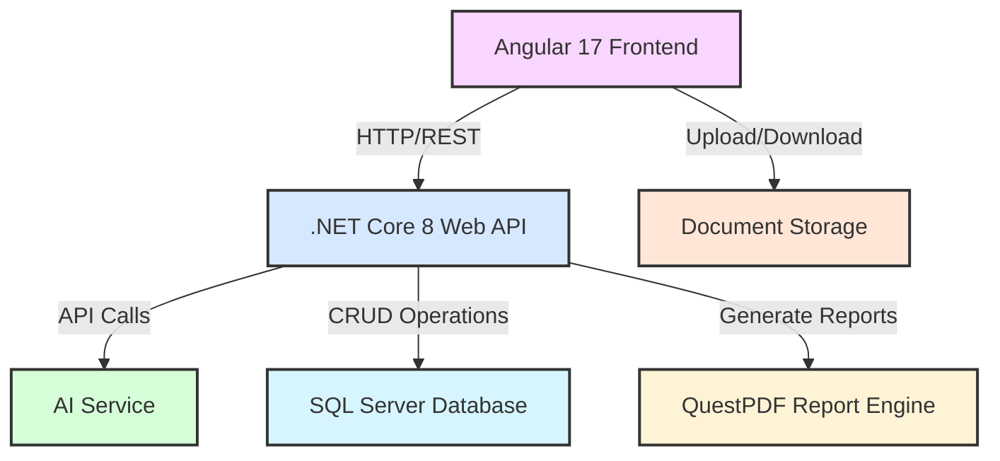
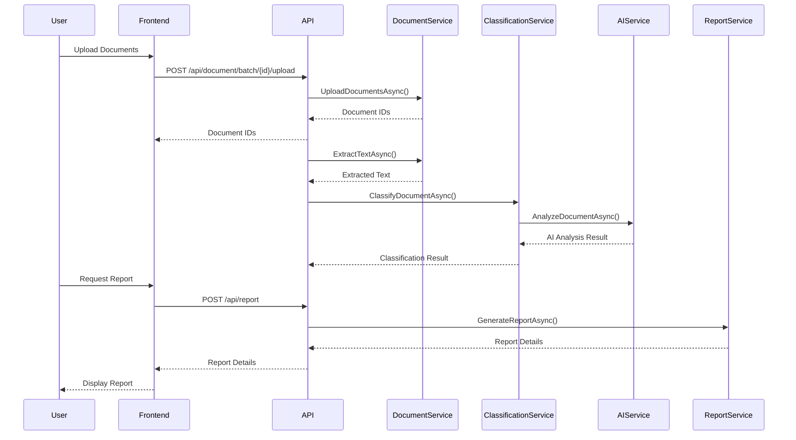
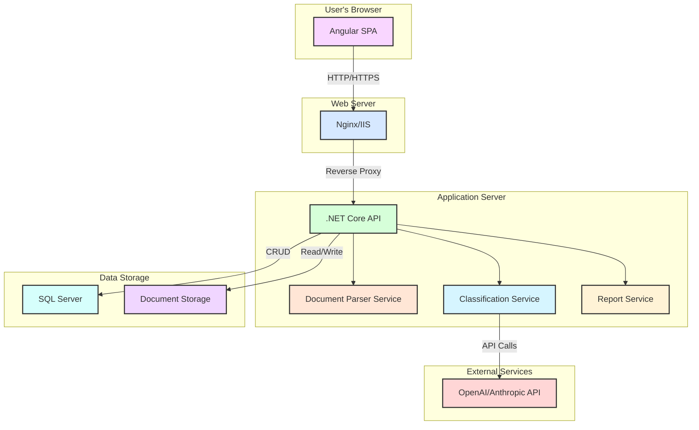

# Compliance Document Classifier - System Architecture

## Overview

The Compliance Document Classifier is a proof-of-concept application designed to automate the classification, risk assessment, and summarization of compliance-related documents. This document provides a comprehensive overview of the system architecture, including all components and their interactions.

## High-Level Architecture

The system follows a clean, layered architecture with clear separation of concerns:

## Architectural Layers

The system is organized into the following architectural layers:

### 1. Presentation Layer (Angular 17 + PrimeNG 16)

The presentation layer provides the user interface for document upload, classification review, and report generation.

- **Upload Component**: Handles document batch uploading via drag-and-drop interface
- **Results Component**: Displays classification results with filtering and override capabilities
- **Report Component**: Displays generated reports with view, download, and share options

### 2. API Layer (.NET Core 8 Web API)

The API layer exposes RESTful endpoints for the frontend to interact with the system.

- **Document Controller**: Handles document upload, storage, and retrieval
- **Classification Controller**: Manages document classification and overrides
- **Report Controller**: Handles report generation and retrieval

### 3. Application Layer

The application layer contains application services, DTOs, and use cases.

- **Document Service**: Orchestrates document processing workflows
- **Classification Service**: Manages AI-based document classification
- **Report Service**: Handles report generation and management

### 4. Domain Layer

The domain layer contains the core business entities, interfaces, and business logic.

- **Aggregates**: Document, Classification, Batch, Report
- **Value Objects**: DocumentMetadata, AIModelConfig
- **Domain Events**: DocumentUploadedEvent, DocumentClassifiedEvent, etc.
- **Interfaces**: Repository interfaces, service interfaces

### 5. Infrastructure Layer

The infrastructure layer provides implementations of interfaces defined in the domain layer.

- **Document Parsers**: Implementations for different document formats
- **AI Service Adapters**: Integrations with OpenAI and Anthropic
- **PDF Generator**: Implementation using QuestPDF
- **Repositories**: Data access implementations

## Component Interactions

The following diagram illustrates the key interactions between components:

## Deployment Architecture

The system is designed to be deployed as a set of containerized services:

## Technology Stack

The system utilizes the following technologies:

### Frontend
- **Framework**: Angular 17
- **UI Components**: PrimeNG 16
- **State Management**: NgRx
- **HTTP Client**: Angular HttpClient

### Backend
- **Framework**: .NET Core 8
- **API**: ASP.NET Core Web API
- **Document Parsing**:
  - PDF: PdfPig
  - DOCX: DocumentFormat.OpenXml
  - TXT: Native .NET
- **PDF Generation**: QuestPDF
- **AI Integration**: 
  - OpenAI GPT-4 Turbo
  - Anthropic Claude v2

### Data Storage
- **Database**: SQL Server
- **Document Storage**: File system or blob storage

## Scalability Considerations

The system architecture supports horizontal scaling through:

1. **Stateless API Design**: API servers can be scaled horizontally behind a load balancer
2. **Separate Document Processing**: Document parsing can be offloaded to worker services
3. **Queue-Based Processing**: Batch document processing can use message queues for reliability
4. **Caching**: Frequently accessed data can be cached to reduce database load

## Security Architecture

The system implements several security measures:

1. **Authentication**: JWT-based authentication for API access
2. **Authorization**: Role-based access control for different operations
3. **Input Validation**: All user inputs are validated to prevent injection attacks
4. **Secure File Handling**: Document storage with proper access controls
5. **API Security**: HTTPS, rate limiting, and proper error handling
6. **Data Protection**: Encryption for sensitive data at rest and in transit

## Conclusion

The Compliance Document Classifier architecture provides a robust, scalable, and secure foundation for automating document classification and risk assessment. The clean separation of concerns and modular design allow for easy maintenance and extension of the system.